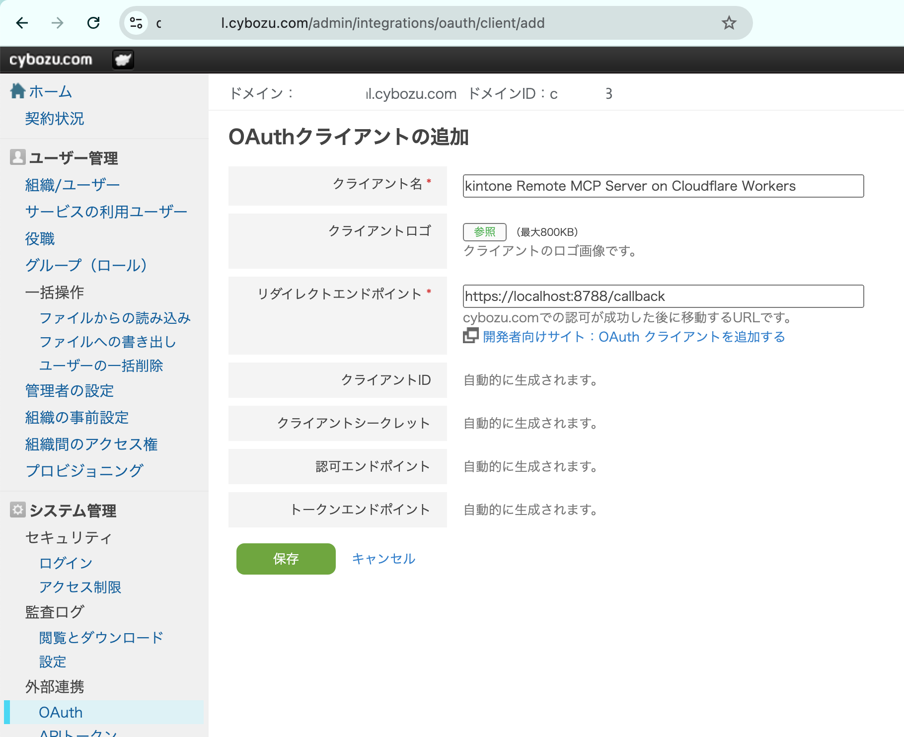
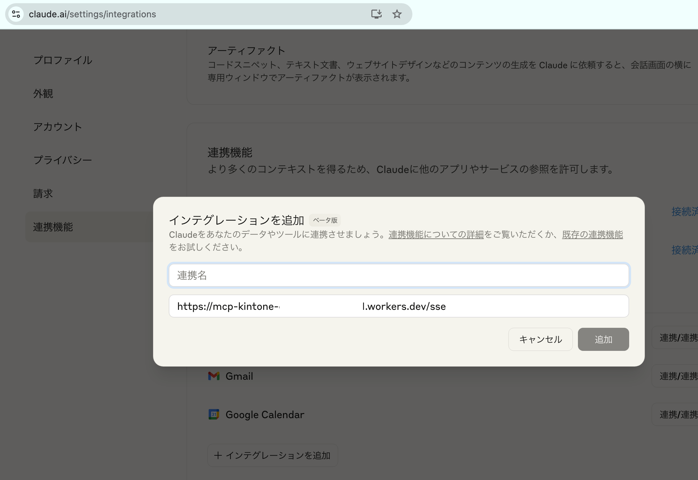
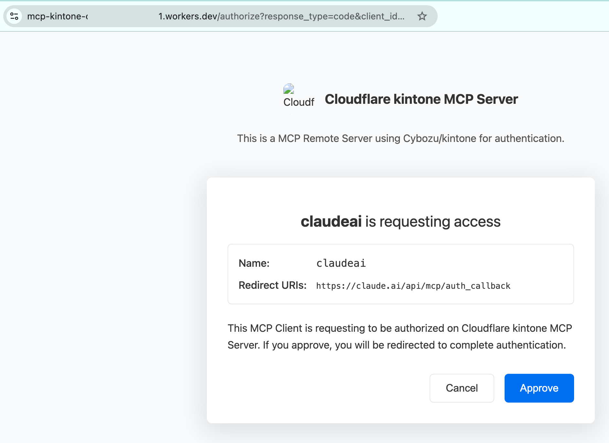
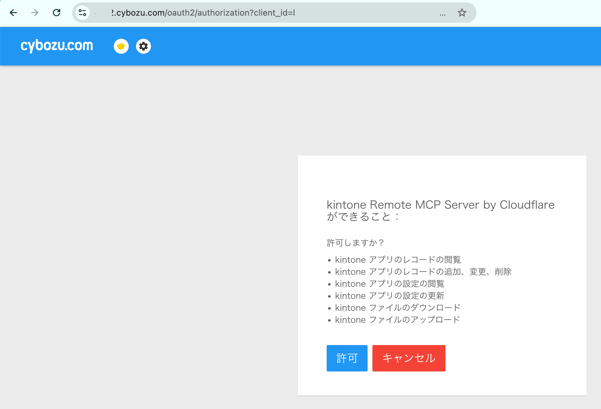
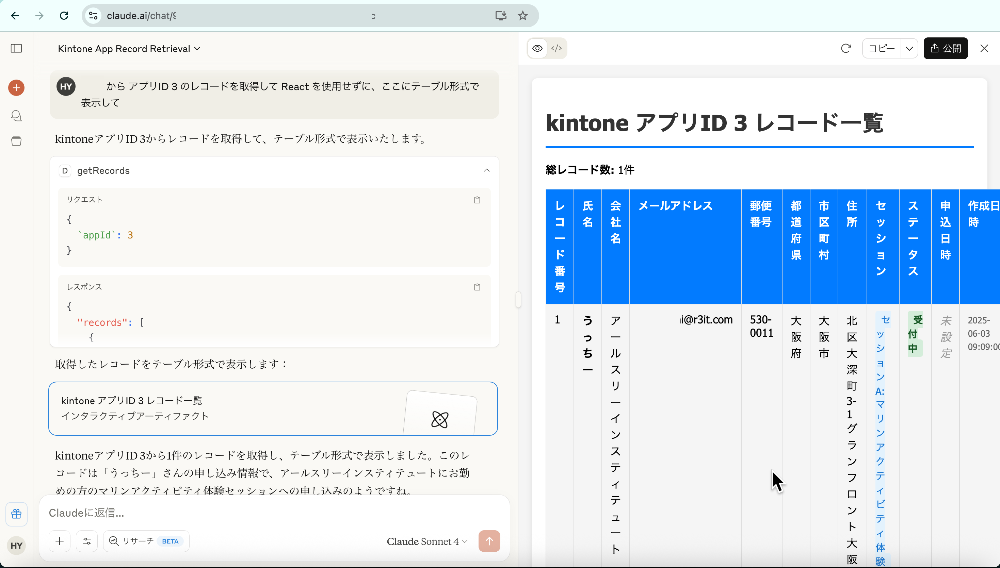

# リモート Model Context Protocol (MCP) サーバー for kintone via OAuth on Cloudflare Workers

これは Cloudflare Workers として deploy可能な [kintone](https://kintone.cybozu.co.jp/) 用の [Model Context Protocol (MCP)](https://modelcontextprotocol.io/introduction) サーバーのサンプルコードです。

OAuth で認証するため、（秘匿すべき）認証情報をローカルディスク内などに保存しません。

ある cybozu.comドメイン用に この MCP Sever を deploy しておけば、そのドメインを使用する全ての人がこの MCP Server を共用利用することができます。

プログラムをローカルにセットアップする必要がなく、Webブラウザー版の Claude からも使用することができます。

## 始め方

### cybozu.com共通管理画面で OAuthクライアントを追加

[こちらの手順](https://cybozu.dev/ja/common/docs/oauth-client/add-client/) に従い OAuthクライアントを追加してください。

- 「クライアント名」は分かりやすい名前を設定（「kintone Remote MCP Server on Cloudflare Workers」などといったように）
- 「リダイレクトエンドポイント」の指定は、この MCP Server を Cloudflare Workers へ deploy したあとで `https://<your-subdomain>.workers.dev/callback` を指定しますので、いったんは `https://localhost:8788/callback` を設定します。
- 「保存」をクリックすると「クライアントID」と「クライアントシークレット」が自動的に生成されますので手元に控えてください。

<!-- markdownlint-disable MD033 -->

<!-- markdownlint-enable MD033 -->

- OAuthクライアントの「利用者の設定」で、この MCP Server を利用させるユーザーを指定してください。

### Cloudflare Workers への deploy

- リポジトリをクローンし、依存関係をインストールします: `npm install`.

- OAuthクライアントを作成した際に控えた値を Wranglerの設定ファイル（wrangler.jsonc）内に記入します。：

```json
	"vars": {
		"CYBOZU_CLIENT_ID": "<your cybozu.com client id>",
		"CYBOZU_CLIENT_SECRET": "<your cybozu.com client secret>",
		"CYBOZU_SUBDOMAIN": "<your cybozu.com sub domain>", # your cybozu.com subdomain
		"COOKIE_ENCRYPTION_KEY": "<your cookie encryption key>", # add any random string here e.g. openssl rand -hex 32
		"WORKER_URL": "<your worker url>"
	},
```

#### KV名前空間の作成

- wrangler CLI で以下を実行して KV名前空間を作成します。:

`wrangler kv:namespace create "OAUTH_KV"`

- Wranglerの設定ファイル（wrangler.jsonc）内の `<your cloudflare kv id>` 欄に、作成された KV の ID を記入してください。

- 以下のコマンドを実行して Cloudflare Workers へ deploy してください。

`wrangler deploy`

- deploy が完了したら Workers の URL を cybozu.com共通管理画面の OAuthクライアントの「リダイレクトエンドポイント」欄にセットし、末尾に `/callback` を付けてください。 `https://<your-subdomain>.workers.dev/callback` と入力することになります。

### Claude WebアプリからリモートMCPサーバーにアクセス

- [Claude Webアプリのインテグレーション管理画面](https://claude.ai/settings/integrations) にアクセスし
「インテグレーションを追加」をクリックします。

- 「連携名」は MCP Server を識別する際の名前になるので、分かりやすいものを付けます。

- 「連携URL」に `https://<your-subdomain>.workers.dev/sse` と入力してください。

<!-- markdownlint-disable MD033 -->

<!-- markdownlint-enable MD033 -->

- 「追加」ボタンをクリックしたのち、「連携/連携させる」をクリックします。 OAuthの確認画面が表示されるので「Approve」「許可」をクリックします。

<!-- markdownlint-disable MD033 -->

<!-- markdownlint-enable MD033 -->

<!-- markdownlint-disable MD033 -->

<!-- markdownlint-enable MD033 -->

- Claude WebアプリからリモートMCPサーバーを利用できるようになります。

<!-- markdownlint-disable MD033 -->

<!-- markdownlint-enable MD033 -->


### Claude DesktopからリモートMCPサーバーにアクセス

Claude Desktopで、Settings -> Developer -> Edit Configを開き、以下の設定を追加。Claude Desktopを再起動すると、OAuthログイン画面が表示され、認証フローを完了するとClaudeがMCPサーバーにアクセスできるようになります。


```json
{
  "mcpServers": {
    "kintone": {
      "command": "npx",
      "args": [
        "mcp-remote",
        "https://<your-subdomain>.workers.dev/sse"
      ]
    }
  }
}
```

## このプロジェクトの由来

このプロジェクトは、もともとCloudflareのGitHub OAuthテンプレートを使用して作成されました：

```bash
npm create cloudflare@latest -- kintone-oauth-mcp-server-cfw --template=cloudflare/ai/demos/remote-mcp-github-oauth
```

このテンプレート（[CloudflareのRemote MCP Serverガイド](https://developers.cloudflare.com/agents/guides/remote-mcp-server/)で説明あり）は、OAuth認証を備えたMCPサーバーの構築基盤を提供します。本プロジェクトでは、このテンプレートを Cybozu/kintone OAuth 用に改修し、CybozuのOAuth 2.0実装に対応した認証フローを実現しています。

## 元のテンプレートからの主な変更点

GitHub OAuthテンプレートをkintoneに対応させるため、以下の変更を行いました：

1. **OAuthハンドラー**: `src/cybozu-handler.ts` を新規作成し、kintoneのOAuthフローを処理（ `github-handler.ts` を置き換え）
2. **OAuthエンドポイント**: Cybozu OAuthのエンドポイントに変更：
   - 認可: `https://{subdomain}.cybozu.com/oauth2/authorization`
   - トークン: `https://{subdomain}.cybozu.com/oauth2/token`
3. **認証方式**: kintoneのOAuth 2.0仕様に合わせ（クレデンシャルはリクエストボディに含める）
4. **環境変数**: GitHub用からkintone用に変更：
   - `GITHUB_CLIENT_ID` → `CYBOZU_CLIENT_ID`
   - `GITHUB_CLIENT_SECRET` → `CYBOZU_CLIENT_SECRET`
   - `CYBOZU_SUBDOMAIN` を追加（kintoneのサブドメイン用）
5. **スコープ**: kintone APIのスコープを使用 (例: `k:app_record:read`, `k:app_record:write`, `k:app_settings:read` )

## ローカル開発とテスト

HTTPSを有効にしてサーバーを起動:

```bash
wrangler dev --local-protocol https
```

Inspectorで `https://localhost:8788/sse` に接続してテスト。

**注意**: 初回アクセス時には、ブラウザで自己署名証明書の警告を受け入れる必要があります。

## OAuth設定トラブルシューティング

### 401エラーが発生する場合

以下の点を確認してください：

1. **Cybozu Developer Networkでの設定**
   - リダイレクトURIが完全一致していることを確認
     - 本番環境: `https://<your-subdomain>.workers.dev/callback`
     - 開発環境: `https://localhost:8788/callback`
   - OAuthアプリケーションが「有効」になっている
   - client_idとclient_secretが正しくコピーされている
   - 必要なスコープが設定されている: `k:app_record:read k:app_record:write k:app_settings:read`

2. **環境変数の確認**

   ```bash
   # .dev.varsファイルまたはwrangler secretsで以下を確認
   CYBOZU_CLIENT_ID=<your-client-id>
   CYBOZU_CLIENT_SECRET=<your-client-secret>
   CYBOZU_SUBDOMAIN=<your-subdomain>
   COOKIE_ENCRYPTION_KEY=<random-32-char-string>
   ```

3. **ログの確認**
   開発サーバー起動時のコンソールで以下を確認：
   - `OAuth Callback Received` - コールバックが正しく受信されているか
   - `Starting Token Exchange` - トークン交換が開始されているか
   - エラーレスポンスの詳細内容

4. **kintone OAuth仕様**
   - 認可エンドポイント: `https://{subdomain}.cybozu.com/oauth2/authorization`
   - トークンエンドポイント: `https://{subdomain}.cybozu.com/oauth2/token`
   - 認証方式: リクエストボディにclient_idとclient_secretを含める
   - レスポンス形式: JSON

5. **デバッグモード**
   詳細なログを確認するには、開発サーバーを起動して実行できます：

   ```bash
   npm run dev
   ```

## 仕組みの概要

### OAuthプロバイダー

OAuth Providerライブラリは、Cloudflare Workers向けのOAuth 2.1サーバー実装です。
このライブラリがOAuthフロー全体（トークン発行、検証、管理）を担当しています。具体的には：

- MCPクライアントの認証
- kintone OAuthサービスへの接続管理
- KVストレージでのトークン・認証状態の安全な保存

### MCP Remote

MCP Remoteライブラリは、サーバーがクライアントにツールを提供できるようにします：

- クライアントとサーバー間の通信プロトコルを定義
- ツールの定義方法を提供
- リクエスト/レスポンスのシリアライズ・デシリアライズを管理
- クライアントとサーバー間のServer-Sent Events (SSE)接続を維持

## MCP Server を使用するリスク

他人が作成・実装した MCP server を使用する際には一定のリスクがあることを必ず念頭において利用してください。

- [kintone AIラボ と kintone用 MCP Server の現在地](https://www.r3it.com/blog/kintone-ai-lab-20250501-yamauchi)

**「kintone」はサイボウズ株式会社の登録商標です。**

ここに記載している内容は情報提供を目的としており、個別のサポートはできません。
設定内容についてのご質問やご自身の環境で動作しないといったお問い合わせをいただいても対応はできませんので、ご了承ください。
